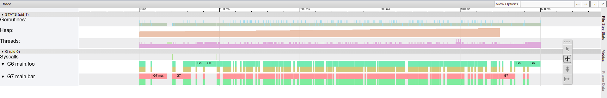
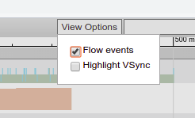
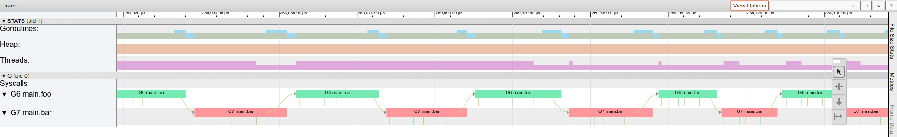
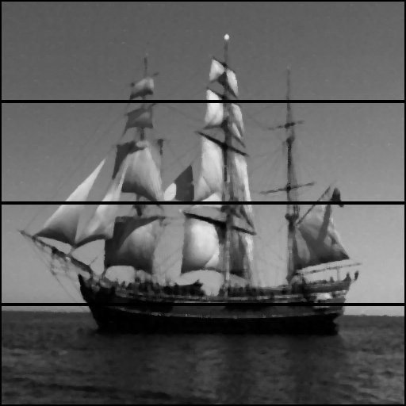
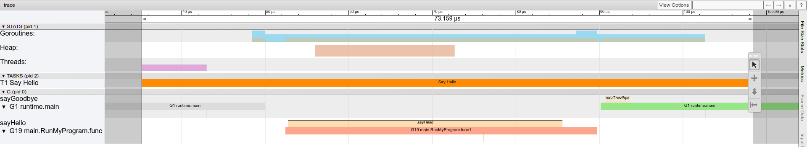

# Lab 2: Basic concurrency

> If you're stuck look at examples on [Go by Example](https://gobyexample.com/)

## Go concurrency syntax

```go
go someFunc()
```

Starts a new goroutine. `someFunc` has to be a void function.

```go
channel := make(chan int)
```

Makes a new channel to be used to communicate between two goroutines. You can think of `make` as Go's version of `malloc`. It allocates memory for objects. However, you don't have to worry about freeing the memory as Go has a built-in garbage collector.

```go
channel <- 5
```

Sends one message (the integer 5) to the channel.

```go
number := <-channel
```

Receives one message from a channel and assign it to a new variable called `number`.

```go
sendOnly chan<- int
```

Channel of type `chan<-` is send-only. Receiving a message from a channel of that type will cause a compiler error.

```go
receiveOnly <-chan int
```

Channel of type `<-chan` is receive-only. Sending a message to a channel of that type will cause a compiler error.

## Question 1 - Messages

### Question 1a

Open `messages.go`. In `messages.go` we create a channel for strings and then use it to pass 3 strings between `sendMessages` and `main`.

Run the program and make sure you fully understand the output.

### Question 1b

Modify the function `main()` so that only 2 messages are received. Do not modify the `sendMessages()` function.

Run the program and explain the output. Look at which messages have been received **and** which ones have been sent.

### Question 1c

Modify the function `main()` so that 4 messages are received. Do not modify the `sendMessages()` function.

Run the program and explain what has happened and why.

### Question 1d

Modify the function `main()` so that 3 messages are received. Modify the `make` function call in main so that `messages` is a **buffered** channel of strings with buffer size 3. Do not modify the `sendMessages()` function.

Run the program and explain how the result differs compared to the original solution with no buffered channels.

## Question 2 - Ping Pong

### Question 2a

Open `ping.go`. It's a skeleton for a "ping-pong" program. Implement one round of ping-pong: `foo()` should send a string `ping` to `bar()` and `bar()` should respond with the string `pong`. After that `foo()` should receive a `pong`.

Ignore the contents of `main()` for now.

Include `Println`s to show what has been sent and received. Example output:

```bash
$ go run ping.go

Foo is sending: ping
Bar has received: ping
Bar is sending: pong
Foo has received: pong
```

### Question 2b

Make both `foo()` and `bar()` run in infinite loops - i.e. After receiving a `pong` the goroutine `foo()` should send another `ping`. `foo()` and `bar()` should continue doing this infinitely (until the program terminates from `time.Sleep(500 * time.Millisecond)`).

Example output:

```bash
$ go run ping.go

Foo is sending: ping
Bar has received: ping
Bar is sending: pong
Foo has received: pong

Foo is sending: ping
Bar has received: ping
Bar is sending: pong
Foo has received: pong

Foo is sending: ping
Bar has received: ping
Bar is sending: pong
Foo has received: pong

Foo is sending: ping
Bar has received: ping
Bar is sending: pong
Foo has received: pong
...
```

### Question 2c

You may have noticed that `main` talks about tracing. An execution trace in go is similar to a stack trace, except now we have multiple threads of execution and therefore a simple linear trace is no longer very clear. An execution trace allows us to see exactly when each goroutine was running, in which function and how it communicated with other goroutines.

Running your `ping.go` should have generated a `trace.out` file. You can open the trace file with the command `go tool trace trace.out`. This will provide you with a link that you must open in **Chromium or Chrome** - the trace viewer will not work in other browsers.

Click on `Goroutine analysis`, `main.foo`, and then whatever number it says under the `Goroutine` heading. You should see a trace like this:



Firstly, enable `flow events` under `view options` in the top-right corner. This will display arrows that indicate channel communication and use of the `go` keyword.



To navigate the trace you will need to use your keyboard. Use W and S to zoom in and out (it will zoom to where your mouse is), and A and D to move left and right. Now zoom in so that you see a part of the trace that looks like this:



If your ping-pong code is correct your trace should look very similar to the one above. Each block means that the goroutine was running and each arrow represents a message on a channel.

Explain how the trace relates to the code you have written.

## Question 3 - Median Filter

Open the images in the `filter` directory. As you can see, they all have 'salt and pepper' noise. Now open `medianFilter.go`. It's a single-threaded implementation of a Median Filter, which removes the salt and pepper noise. It runs through the image pixel by pixel and replaces each value with the median of neighbouring values. In this implementation, the algorithm has hardcoded radius 2 and therefore it looks at 24 neighbours (as well as its own value).

### Question 3a

```bash
Usage of ./medianFilter:
  -in string
        Specify the input file. (default "ship.png")
  -out string
        Specify the output file. (default "out.png")
```

Read the source code, run the filter on the provided images and verify that the noise has been removed.

### Question 3b

The median filter is an example of a problem that is "embarrassingly parallelisable". Consider having 4 worker threads. We could split the image into 4 parts and ask each worker to process their chunk in parallel to other workers. At the end, we can collect the result and output the final image.

#### Sending

The first problem we encounter when parallelising is how to send the workers their respective chunks of the image:

We *could* use channels of type `chan [][]uint8` to send parts of the image to the worker as pure 2D slices. For example using the notation `image[0:128]`. This is not a good solution. Recall from lab 1 that passing a slice to a function simply passes a pointer. If we passed the same slice to multiple workers we could end up concurrently modifying the slice causing an incorrect resulting image.

We *could* use channels of type `chan uint8` to pass `uint8` values one by one, rather than slices. While this is a valid and safe solution, it isn't particularly fast.

Instead, today we will explore how to create a *closure* that will make our slice immutable.

The variable `immutableData` in the function `filter()` is a closure. It is **not** a slice or any other data type. The function `makeImmutableMatrix(...)` returns a function. It stores a reference to a 2D slice and given `y` and `x` coordinates it returns a `uint8` from that slice that it wraps - it is similar to an object with a getter in java. Such a function with hidden state is called a [closure](https://gobyexample.com/closures).

The use of a closure means that the slice it wraps effectively becomes immutable. As a programmer, you now have no direct access to the pointer and therefore no way of modifying the slice. This will allow us to pass the closure to multiple goroutines without causing any potential [race conditions](https://en.wikipedia.org/wiki/Race_condition) since concurrent read operations are perfectly safe - concurrent writes or reads when a write may be happening almost always aren't.

#### Receiving

The second problem is receiving and reconstructing the image back in the function `filter()`:

We *could* use channels of type `chan uint8` to pass `uint8` values one by one. While this is a valid and safe solution, it isn't particularly fast.

We *could* use a channel of type `chan func(y, x int) uint8` to send back a closure. However, to put together the final image in a single 2D slice we will need to use `append`, which is not supported by a closure. We would, therefore, end up extracting the `uint8` values one by one which is slow.

Our solution will use a channel of type `chan [][]uint8` to send the resulting image back to `filter()`. We will send a slice (~pointer) over a channel, but in this case, there are no race conditions, because the worker exits immediately after sending the slice. This does not invalidate the memory (like it could in C). As a result, the slice will only be owned by a single goroutine (the `filter()` one) and there will be no race conditions.

#### Task

Start parallelising the median filter by creating a `worker(...)` function. Given a closure and some y and x bounds it should apply the median filter between these bounds and 'return' the newly created slice.

<details>
    <summary>Hint 1</summary>

The signature of the worker function could be:

```go
func worker(startY, endY, startX, endX int, data func(y, x int) uint8, out chan<- [][]uint8) {

}
```

</details>

<details>
    <summary>Hint 2</summary>

You only need two lines of code in the worker. One to execute the median filter and one to send the resulting slice back on the `out` channel.

</details>

### Question 3c

Now that we've created a worker we need to change how `filter()` works. It needs to distribute the image between 4 workers, wait for them to finish, and then reconstruct the image in a single 2D slice so that it can be saved to a file.

Instead of directly applying the median filter, change `filter()` so that:

- It starts four workers with the `go` keyword (using a for loop).
- It collects the resulting parts into a single 2D slice (using a for loop and `append`).

Run the filter and make sure the image is correct. It should look like this:



<details>
    <summary>Hint 1</summary>

The workers each need a channel to send their output on. You need to create a slice of 4 channels - one for each worker.

You need to make a slice of type `[]chan [][]uint8` and then, in a for loop, make individual channels of type `chan [][]uint8`.

</details>

<details>
    <summary>Hint 2</summary>

Start 4 workers using the `go` command. For an image of size 512x512 (such as `ship.png`) they need to work on following y-coordinates:

- Worker 1: 0-128
- Worker 2: 128-256
- Worker 3: 256-384
- Worker 3: 384-512

(x-coordinates would be 0-512 for all workers)

</details>

<details>
    <summary>Hint 3</summary>

To reconstruct the image in a single 2D slice you can collect all the parts from the workers and use `append` to attach the matrices together. E.g.:

```go
newData = append(newData, part...)
```

Where both `newData` and `part` are 2D slices.

</details>

### Question 3d

When parallelising, our main aim is to make the processing faster. Using benchmarks you can measure just how fast your program is. To run a benchmark use the command `go test -bench . -benchtime 10x`. It will run our filter 10 times and return the average time the filter took. Run the benchmark on your new parallel filter as well as the original single-threaded one that you were given.

Compare the results and conclude whether the parallel filter is faster.

### Question 3e

Use the code from `main()` in `ping.go` to generate a trace of your parallel filter. Verify that the filter is processing the image via the worker goroutines.

--------------------------------------------------------------------

## **EXTRA**

## **OPTIONAL** Question 1

If your processed image has black lines like the one we have shown above it is because you divided the image exactly in 4 parts. For each given pixel of the image, the filter needs neighbours in radius 2 - i.e. given bounds 0-128 it will only process pixels in bounds 2-126.

Fix your code so that the resulting image looks the same as it used to with the single-threaded filter.

## **OPTIONAL** Question 2

Go traces are quite powerful. You can define tasks and regions in your code and log messages.

Read [this article](https://medium.com/@felipedutratine/user-defined-runtime-trace-3280db7fe209) and experiment with logging messages, and defining tasks and regions in your ping-pong program. The trace generated from the example program from the article looks like this:

(note the Say Hello task, and sayHello/sayGoodbye regions in the 2 goroutines)



Try to achieve something similar in `ping.go`.
