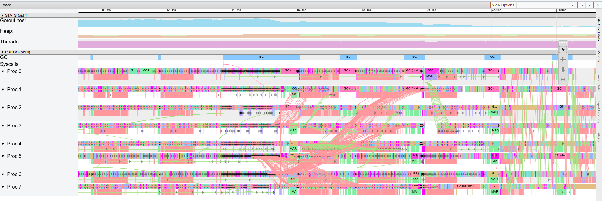
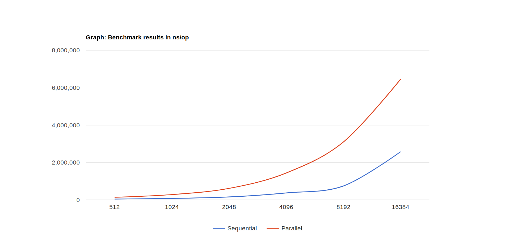
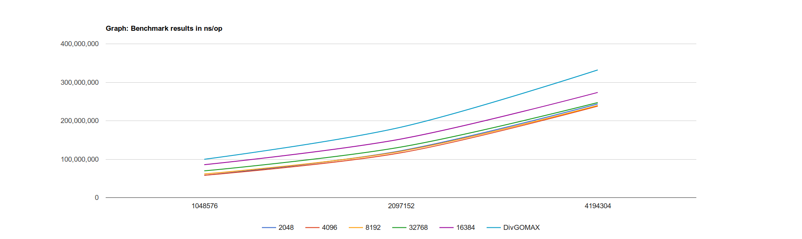

# Lab 3: Advanced concurrency

> If you're stuck look at examples on [Go by Example](https://gobyexample.com/)

## Question 1 - for-select

Sometimes we do not know which channel to receive from. The example program `select.go` illustrates this problem. We have two goroutines: `fastSender` and `slowSender`. In `main` we would like to receive all messages from the two goroutines but we do not know when each message arrives. A select statement is a solution to this problem. Given a list of cases it will wait until it finds one that can be executed and then it will run the code after the `:` . In this program the two possible cases are "string received from `strings`" and "integer received from `ints`" :

```go
for {  // An empty for is Go's equivalent of 'while(true).'
    select {
    case s := <-strings:
        fmt.Println("Received a string", s)
    case i := <-ints:
        fmt.Println("Received an int", i)
    }
}
```

### Question 1a

Run the program and explain the output.

### Question 1b

Write a new function `func fasterSender(c chan<- []int)` that sends the slice `[1, 2, 3]` to `main` every 200 ms. Add another case in the select statement for receiving these slices from the `fasterSender`.

Run your program. Ensure that your result looks similar to this example output:

```bash
$ go run select.go

Received a slice [1 2 3]
Received a slice [1 2 3]
Received an int 0
Received a slice [1 2 3]
Received a slice [1 2 3]
Received an int 1
Received a slice [1 2 3]
Received a slice [1 2 3]
Received a slice [1 2 3]
Received an int 2
Received a slice [1 2 3]
Received a slice [1 2 3]
Received a string I am the slowSender
Received an int 3
Received a slice [1 2 3]
Received a slice [1 2 3]
Received a slice [1 2 3]
Received an int 4
Received a slice [1 2 3]
Received a slice [1 2 3]
Received an int 5
Received a slice [1 2 3]
Received a slice [1 2 3]
Received a slice [1 2 3]
Received an int 6
Received a slice [1 2 3]
Received a slice [1 2 3]
Received a string I am the slowSender
Received an int 7
Received a slice [1 2 3]
Received a slice [1 2 3]
Received a slice [1 2 3]
Received an int 8
Received a slice [1 2 3]
Received a slice [1 2 3]
Received an int 9
...
```

### Question 1c

A [default case](https://gobyexample.com/non-blocking-channel-operations) is a special case in the select statement that will be executed if and only if no other cases could be executed. Add a default case to the select statement containing the following code:

```go
fmt.Println("--- Nothing to receive, sleeping for 3s...")
time.Sleep(3 * time.Second)
```

Run the program and explain the output.

### Question 1d

Make all of your channels **buffered**. Set the buffer size to 10.

Run the program and explain the output.

### **OPTIONAL** Question 1e

Create traces for all versions of the select program and explain how they correspond to the code you have written.

## Question 2 - Quiz

Open `quiz.go`. It's a sample solution to the quiz task that you might remember from lab 1. Today we will explore advanced concurrency concepts and language features to improve our quiz.

Your task is to use the for-select construct demonstrated in `select.go` to satisfy the following new quiz requirements:

1. The quiz should only run for 5 seconds. After that time the final score should be printed to the user.

2. The quiz program must terminate immediately after the 5 seconds have elapsed. Specifically, it **must not** wait for the user's answer to the current question before terminating.

### Question 2a

As part of the `ask()` function, we have to wait for the user's input. The function call `scanner.Scan()` will block until it receives a line of text (a string with a newline character at the end). An operation that may need to wait for some event is known as a *blocking operation*. Other blocking operations include channel send/receive operations (on a non-buffered channel send operation may block and wait for the matching receive and vice versa).

However, we described above that we would like to check the timer and terminate the program while the user is thinking about the answer. Goroutines offer a solution to this problem. If we turn `ask` into a goroutine it will be able to block and wait for user input while `main` will be able to continue to work.

Modify the quiz program so that ask is always called as a goroutine - i.e. ask is always of the form `go ask(...)`. Verify that the quiz still works as expected and that the score printed out is correct.

<details>
    <summary>Hint 1</summary>

You have to modify both `main` and `ask`.

</details>

<details>
    <summary>Hint 2</summary>

Recall that to return from a goroutine you have to use a channel.

</details>

### Question 2b

Using your new `ask` goroutine modify `main` so that it satisfies the 2 new requirements.

Play the quiz. State the number of different threads your solution uses and explain how they communicate with each other.

<details>
    <summary>Hint 1</summary>

In this question, you do not need to modify `ask`.

</details>

<details>
    <summary>Hint 2</summary>

Your new program should use 3 threads:

- A blocking goroutine `ask` that waits for the user's input.
- The `main` goroutine which will hold state such as score and index of the current question.
- A timer thread that will send a message on a channel after 5s.

</details>

<details>
    <summary>Hint 3</summary>

You select statement will have 2 cases. One for an updated score and one for a timeout message from the timer. You do not need to use a default case here.

</details>

## Question 3 - Parallel tree reduction

So far we explored concurrency with only a handful for goroutines. In this question, you will explore using a very large number of goroutines and you will analyse any costs and benefits of doing so. For example, the trace below illustrates over 8000 goroutines working on sorting a slice of size 10,000,000:



### Question 3a

Open `merge.go`. It's a working merge sort program. Your task will be to parallelise the merge sort in the `parallelMergeSort()` function.

Write a parallel merge sort that creates 2 new goroutines at each split point. Run the `main()` function and verify that the printed slice is correctly sorted. After that, run the benchmarks and draw conclusions about the speed of your implementation. You can plot a graph of your benchmarks using the commands:

```bash
$ go get github.com/ChrisGora/benchgraph
$ go run test -bench . | benchgraph
```

*Note:* Doing parallel merge sort on a slice will involve concurrent writes. Normally, this is not recommended. However, in this particular problem, each goroutine will have own section of the slice to work on. Hence passing the slice is correct but still very bug-prone. You have to make sure that there is no overlap between the sections that the goroutines are working on. We provided you with the `merge()` function which was carefully written to avoid bugs and race conditions.

<details>
    <summary>Hint 1</summary>

Start by copying the sequential merge sort into `parallelMergeSort()`.

</details>

<details>
    <summary>Hint 2</summary>

You have to wait for both workers to finish before calling `merge(...)`. This can be done using channels of type `chan bool` or with [WaitGroups](https://gobyexample.com/waitgroups).

</details>

### Question 3b

The parallel version is slower than the sequential one! If you used benchgraph you would've obtained a graph like this:



While goroutines are quite lightweight, this experiment shows that they still have an associated overhead. We can make the parallel merge sort faster by reducing the number of goroutines created.

Firstly, at every split, only one new goroutine is needed rather than two. This concept is illustrated below. It's a parallel tree reduction where the operation is addition (rather than a merge sort) on 8 elements.

*Note:* Although the animation shows 8 threads for clarity all odd threads are redundant as they only pass a message to a thread to their left and don't perform any computation.


Run benchmarks and analyse the performance of your new algorithm. Given a slice of size `n` state how many goroutines your first version would've used and how many your new version now uses.

<details>
    <summary>Hint</summary>

When splitting right start a new goroutine. When splitting left, do a simple recursive function call. Make sure you do the splitting in that order (new goroutine first and function call second).

</details>

### Question 3c

Modify your `parallelMergeSort()` so that below a certain length of the slice it stops spawning new goroutines and instead calls the sequential `mergeSort()`.

Experiment with different thresholds and try to empirically find an optimal one that provides the biggest speed-up.

<details>
    <summary>Our analysis...</summary>

In our experiments on an 8 core machine we have found that `1 << 13` ( = 8192) performs (almost)best. This is not a magic number and there may be a reason behind its speed: The Intel Core i5 processor that we ran the merge sort on has one block of 32KiB L1 cache for each core. This means we can fit in 8192 32-bit integers in that space. The actual fastest constant was 4096 and we have no apparent reason for the fact that it is marginally faster. Note that the lab machines have an i7 processor with 6 cores so your results may vary.

[Java's parallel sort was designed in a very similar way.](http://blog.teamleadnet.com/2014/05/java-8-parallel-sort-internals.html)

 Make sure you also experiment with other values. Thresholds lower than the optimum will cause a bottleneck due to goroutine creation and communication. Thresholds greater than the optimum will cause more cache misses and eventually reduce the level of parallelism. If the threshold is greater than the size of the initial slice the algorithm will stop being parallel.

To investigate different approaches we have written some benchmarks on large slices:

```go

const (
	start = 1048576
	end   = 4194304
)

func BenchmarkSequential(b *testing.B) {
	for size := start; size <= end; size *= 2 {
		b.Run(fmt.Sprint(size), func(b *testing.B) {
			os.Stdout = nil // Disable all program output apart from benchmark results
			for i := 0; i < b.N; i++ {
				unsorted := random(size)
				b.StartTimer()
				mergeSort(unsorted)
				b.StopTimer()
			}
		})
	}
}

func Benchmark512(b *testing.B) {
	for size := start; size <= end; size *= 2 {
		b.Run(fmt.Sprint(size), func(b *testing.B) {
			os.Stdout = nil // Disable all program output apart from benchmark results
			for i := 0; i < b.N; i++ {
				unsorted := random(size)
				b.StartTimer()
				parallelMergeSort(unsorted, 512)
				b.StopTimer()
			}
		})
	}
}

func Benchmark1024(b *testing.B) {
	for size := start; size <= end; size *= 2 {
		b.Run(fmt.Sprint(size), func(b *testing.B) {
			os.Stdout = nil // Disable all program output apart from benchmark results
			for i := 0; i < b.N; i++ {
				unsorted := random(size)
				b.StartTimer()
				parallelMergeSort(unsorted, 1024)
				b.StopTimer()
			}
		})
	}
}

func Benchmark2048(b *testing.B) {
	for size := start; size <= end; size *= 2 {
		b.Run(fmt.Sprint(size), func(b *testing.B) {
			os.Stdout = nil // Disable all program output apart from benchmark results
			for i := 0; i < b.N; i++ {
				unsorted := random(size)
				b.StartTimer()
				parallelMergeSort(unsorted, 2048)
				b.StopTimer()
			}
		})
	}
}

func Benchmark4096(b *testing.B) {
	for size := start; size <= end; size *= 2 {
		b.Run(fmt.Sprint(size), func(b *testing.B) {
			os.Stdout = nil // Disable all program output apart from benchmark results
			for i := 0; i < b.N; i++ {
				unsorted := random(size)
				b.StartTimer()
				parallelMergeSort(unsorted, 4096)
				b.StopTimer()
			}
		})
	}
}
//
func Benchmark8192(b *testing.B) {
	for size := start; size <= end; size *= 2 {
		b.Run(fmt.Sprint(size), func(b *testing.B) {
			os.Stdout = nil // Disable all program output apart from benchmark results
			for i := 0; i < b.N; i++ {
				unsorted := random(size)
				b.StartTimer()
				parallelMergeSort(unsorted, 8192)
				b.StopTimer()
			}
		})
	}
}
//
func Benchmark32768(b *testing.B) {
	for size := start; size <= end; size *= 2 {
		b.Run(fmt.Sprint(size), func(b *testing.B) {
			os.Stdout = nil // Disable all program output apart from benchmark results
			for i := 0; i < b.N; i++ {
				unsorted := random(size)
				b.StartTimer()
				parallelMergeSort(unsorted, 32768)
				b.StopTimer()
			}
		})
	}
}

func Benchmark16384(b *testing.B) {
	for size := start; size <= end; size *= 2 {
		b.Run(fmt.Sprint(size), func(b *testing.B) {
			os.Stdout = nil // Disable all program output apart from benchmark results
			for i := 0; i < b.N; i++ {
				unsorted := random(size)
				b.StartTimer()
				parallelMergeSort(unsorted, 16384)
				b.StopTimer()
			}
		})
	}
}

func BenchmarkDivGOMAX(b *testing.B) {
	for size := start; size <= end; size *= 2 {
		b.Run(fmt.Sprint(size), func(b *testing.B) {
			os.Stdout = nil // Disable all program output apart from benchmark results
			for i := 0; i < b.N; i++ {
				unsorted := random(size)
				b.StartTimer()
				parallelMergeSort(unsorted, size/runtime.NumCPU())
				b.StopTimer()
			}
		})
	}
}

```

We have then ran the benchmarks and analysed the results with the benchgraph library:

```bash
$ go run test -bench . | benchgraph

```



</details>
