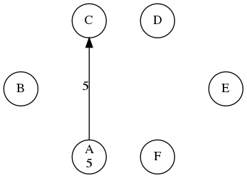
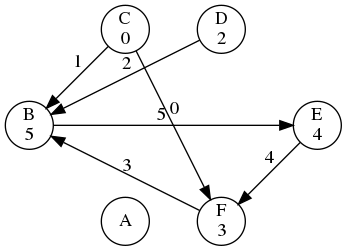

# Lab 4: Beyond Channels

> If you're stuck look at examples on [Go by Example](https://gobyexample.com/)

## Question 1 - Random sum

Open `sum.go`. It's a small program that uses 1000 goroutines to increment the `sum` variable. The correct output of the program should be 1000 since `sum` is initialised to 0 and each of the 1000 goroutines increments it by 1.

Run the program and identify the bug that causes the wrong output. Fix the problem in as many ways as you can. Write one solution that uses channels and at least one that doesn't.

<details>
    <summary>Hint 1</summary>

Run the program with the `-race` flag: `go run -race sum.go`

</details>

<details>
    <summary>Hint 2</summary>

The bug in `sum.go` is a race condition.

</details>

## Question 2 - Producer-consumer problem

Recall the producer-consumer problem that was introduced in the lectures. Open `pc.go`. It uses 2 producers and 1 consumer. The correct behaviour should be as follows:

- **Producer 1:** Puts an integers on the buffer every 0ms-500ms. First value is 1 and each consecutive value increments by 1.

- **Producer 2:** Puts an integer on the buffer every 0ms-500ms. First value is 1000 and each consecutive value decrements by 1.
  
- **Consumer:** Reads an integer from the buffer every 0s-5s.

The example output below demonstrates the **correct** output. Note how a given value in the buffer does not get overwritten until it was read by the consumer.

```bash
$ go run pc.go

Put              1000    &{[1000 0 0 0 0] 5 0 0}
Get              1000    &{[1000 0 0 0 0] 5 0 1}
Put              1       &{[1000 1 0 0 0] 5 1 1}
Put              999     &{[1000 1 999 0 0] 5 1 2}
Put              998     &{[1000 1 999 998 0] 5 1 3}
Put              997     &{[1000 1 999 998 997] 5 1 4}
Put              2       &{[2 1 999 998 997] 5 1 0}
Get              1       &{[2 1 999 998 997] 5 1 1}
Put              996     &{[2 996 999 998 997] 5 2 1}
Get              999     &{[2 996 999 998 997] 5 2 2}
Put              3       &{[2 996 3 998 997] 5 3 2}
Get              998     &{[2 996 3 998 997] 5 3 3}
Put              995     &{[2 996 3 995 997] 5 4 3}
Get              997     &{[2 996 3 995 997] 5 4 4}
Put              4       &{[2 996 3 995 4] 5 0 4}
Get              2       &{[2 996 3 995 4] 5 0 0}
Put              994     &{[994 996 3 995 4] 5 1 0}
Get              996     &{[994 996 3 995 4] 5 1 1}
Put              5       &{[994 5 3 995 4] 5 2 1}
Get              3       &{[994 5 3 995 4] 5 2 2}
Put              993     &{[994 5 993 995 4] 5 3 2}
Get              995     &{[994 5 993 995 4] 5 3 3}


...
```

This can be separated to:

Producer 1

```bash
Put              1       &{[1000 1 0 0 0] 5 1 1}
Put              2       &{[2 1 999 998 997] 5 1 0}
Put              3       &{[2 996 3 998 997] 5 3 2}
Put              4       &{[2 996 3 995 4] 5 0 4}
Put              5       &{[994 5 3 995 4] 5 2 1}
```

Producer 2

```bash
Put              1000    &{[1000 0 0 0 0] 5 0 0}
Put              999     &{[1000 1 999 0 0] 5 1 2}
Put              998     &{[1000 1 999 998 0] 5 1 3}
Put              997     &{[1000 1 999 998 997] 5 1 4}
Put              996     &{[2 996 999 998 997] 5 2 1}
Put              995     &{[2 996 3 995 997] 5 4 3}
Put              994     &{[994 996 3 995 4] 5 1 0}
Put              993     &{[994 5 993 995 4] 5 3 2}
```

Consumer

```bash
Get              1000    &{[1000 0 0 0 0] 5 0 1}
Get              1       &{[2 1 999 998 997] 5 1 1}
Get              999     &{[2 996 999 998 997] 5 2 2}
Get              998     &{[2 996 3 998 997] 5 3 3}
Get              997     &{[2 996 3 995 997] 5 4 4}
Get              2       &{[2 996 3 995 4] 5 0 0}
Get              996     &{[994 996 3 995 4] 5 1 1}
Get              3       &{[994 5 3 995 4] 5 2 2}
Get              995     &{[994 5 993 995 4] 5 3 3}
```

### Question 2a

Look at the example output above. The consumer has just read `995`. State the next 3 values that would be read by the consumer.

### Question 2b

The skeleton you were given will not produce the output shown above. The `consumer()` and `producer()` functions are not properly implemented. When you run the skeleton observe the contents of the buffer and the values that actually reach the consumer (the rows starting with `Get`).

Solve the producer-consumer problem without using channels. You can make use of semaphores (from [our library](https://godoc.org/github.com/ChrisGora/semaphore) which should be automatically downloaded via the `go.mod` file), mutexes (from the built-in `sync.Mutex`) and condition variables (from `sync.Cond`).

- Your solution must be deadlock-free.
- Your solution must not have race conditions.
- Your solution must not use busy waiting.
- Your solution must not use channels.
  - If you could use channels the solution would be to replace the circular buffer with a simple buffered chan.

*Note:* You can detect most race conditions by running the program with `go run -race pc.go`.

<details>
    <summary>Hint</summary>

The simplest solution is to use 2 semaphores and one mutex:

```go
func producer(buffer *buffer, spaceAvailable, workAvailable semaphore.Semaphore, mutex *sync.Mutex, start, delta int) {
    ...
}

func consumer(buffer *buffer, spaceAvailable, workAvailable semaphore.Semaphore, mutex *sync.Mutex) {
    ...
}

func main() {
	buffer := newBuffer(5)
	mutex := // Initialise a mutex

	spaceAvailable := // Initialise a semaphore for spaces available
	workAvailable := // Initialise a semaphore for work available

	go producer(&buffer, ... , 1, 1)
	go producer(&buffer, ... , 1000, -1)

	consumer(&buffer, ...)
}

```

</details>

## Question 3 - Bank

### Introduction

Open the `bank` directory. It's a program that simulates a bank.

- Run the bank program using the command `go run .` 
- Generate visualisations by running `go run . -debug` followed by `./visualise.sh`.
- Detect race conditions by running `go run -race .`.

Our small bank is made up of 6 different accounts (A, B, C, D, E, F). Owners of these accounts love to send money to each other. Your task is to correctly execute 1000 transactions that they requested **as quickly as possible**. We will use 6 executors (worker threads) to complete many transactions in parallel. To help you understand the problem we have written a visualisation tool:



- The arrow indicates that a transaction from account A to account C is in progress.
- The number 5 on the arrow shows the ID of the executor performing this transaction.
- The number 5 under account A shows that this account's mutex has been locked by executor 5.
- All other accounts don't have a number under their names - therefore their mutexes are unlocked.

You are given a buffered channel `transactionQueue` containing 1000 randomly generated transactions. Each transaction is a struct specifying sender and receiver account numbers as well as the amount.

The following rules apply when executing the transactions:

- Each transactions must be executed using the `bank.execute()` method.
- Each transaction takes 50ms-150ms to complete.
- Transactions can be executed in any order.
- An account balance can be negative.
- Every single transaction from the queue must be executed.

### First idea

Use a single worker. The behaviour of this approach is demonstrated in `examples/single.mp4`. This is correct but not concurrent and therefore hugely inefficient, especially with a bigger bank.

### Second idea

Use all the executors. This has been coded for you in the provided skeleton. The behaviour of this approach is also demonstrated in `examples/race.mp4`. This solution is incorrect as it has a race condition. The program finishes but reports the following error:

```bash
Expected transferred 50631
Actual transferred 50631
Expected sum 6000
Actual sum 5694
panic: sum of the account balances does not much the starting sum

```

It executes transactions but due to race conditions (i.e. concurrent writes) the balances in the respective accounts aren't saved correctly. This is the problem that you would have seen in the `sum.go` program.

### Third idea

Use mutexes. Uncomment lines 24-27 and 31-34 in `main.go`. The behaviour of this approach is also demonstrated in `examples/deadlock.mp4`. This solution is incorrect as it deadlocks very quickly. The program will not finish and after brief execution it will report deadlock. Make sure you understand why the below graph is a deadlock:



### Correct behaviour

The correct behaviour is demonstrated in `examples/correct.mp4`. Note how most of the time there are 3 transactions happening concurrently. Make sure you understand that given 6 accounts it would not be possible to execute more than 3 transactions at the same time.

### Your task

Implement an algorithm to correctly execute all the transactions.

- You must start 6 executors. You must not reduce the number of executors to "fix" your solution - it should work with an arbitrary number of executors.
- You are free to use channels, mutexes, semaphores and any other constructs that you wish. Mutexes for each account have already been provided in the account struct. Use them via `bank.lockAccount()` and `bank.unlockAccount()` methods. Do not interact with the mutexes directly (e.g. via `bank.accounts[0].mutex.Lock()`) or you will break the visualisations.
- Your solution must be as concurrent as possible. There should be 3 transactions happening at the same time whenever possible.
- Your solution must be deadlock-free.
- Your solution must not have race conditions.
- Your solution must not use busy waiting.
- Implement your solution in `main.go`. You must not modify the `bank.execute()` method. You should not have to modify other methods in `bank.go`. You can add new elements to the structs and add new methods.

After executing all 1000 transactions `main()` will run 3 simple tests to verify the following:

- The transactionQueue must be empty.
	- If this fails you executed some transactions twice.
- The sum of account balances must be the same as the starting sum (i.e 6000) - money cannot magically appear/disappear.
	- If this fails you probably have a race condition - use the `-race` flag!
- The actual amount of money transferred (saved in the bank struct) must be equal to the sum of all transactions.
	- If this fails you probably didn't execute some transactions despite removing them from the queue and reporting them as done.

<details>
    <summary>Hint 1</summary>

Using mutexes is the right thing to do. But given a transaction from A to B an executor should only be allowed to lock account A if it can lock account B.

What should the executor do if account B is locked? Be very careful to avoid busy-waiting!

</details>

<details>
    <summary>Hint 2</summary>

You could use a manager goroutine that goes through the transaction queue and schedules the transactions in an optimal way.

</details>

<details>
    <summary>Hint 3</summary>

The manager should be the only thread doing the locking. It can then use an internal queue (a buffered chan) to send of transactions that are ready to execute.

</details>
